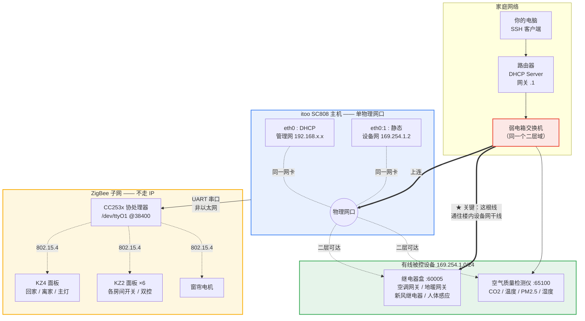
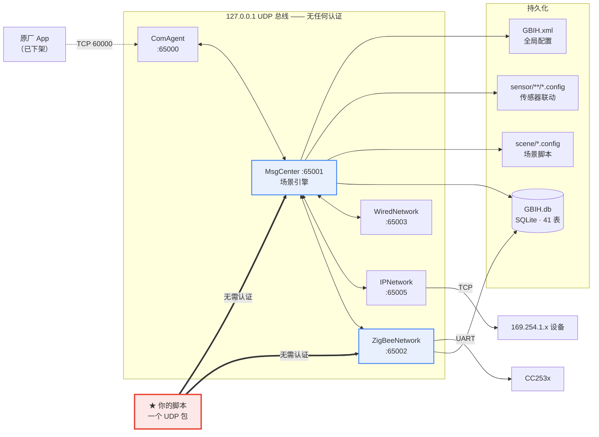

如果你家里（大概率是 2017—2019 年前后交付的精装房）墙上挂着一排 `KZ` 开头的智能开关面板，弱电箱里有一台巴掌大的黑盒子，而配套 App 早就打不开了 —— 这篇文章是写给你的。

我花了几天把这台盒子彻底拆开看了一遍：固件逆向、协议还原、故障定位、修复。**公网上关于这套系统的技术资料是零。** 搜 `GBIH`、`SC808`、`KZ2-4` 什么都搜不到，厂商官网被 SEO 垃圾站占了，App 全区下架。设备自身是唯一的信息源。

所以我把知道的都写在这里，省得下一个人再从头摸一遍。

> 本文所有网络地址都做了泛化处理，只给网段。凭据部分给的是**出厂默认值**，不是我家的设置 —— 恰恰因为它是出厂默认，才对你有用；也恰恰因为它是出厂默认，你应该改掉它。
{: .prompt-info }

---

## 一、这是什么设备

| 项 | 值 |
|---|---|
| 型号 | **itoo SC808**（官方叫法："平层型智控中心服务器"） |
| 厂商 | **爱图智能（深圳）有限公司**（曾用名"万益图"） |
| 硬件 | **BeagleBone Black** —— TI AM335x，ARMv7 Cortex-A8，512MB RAM |
| 系统 | **Ubuntu 13.04 "Raring"**，kernel 3.14.8-bone5 |
| 固件 | `GBIH_Release_Ti_SC808_V9.6.B5.P1_20171106` |
| 无线 | TI CC253x ZigBee 协处理器，挂 `/dev/ttyO1` @ 38400 |
| 存储 | eMMC，`/data` 分区约 2.5G |

是的，**它就是一块贴牌的 BeagleBone Black**。这是个好消息：硬件文档、串口引脚、启动方式全都是公开的，真到了砖化那一步还能救。

### 厂商状态

爱图智能工商状态"存续"，但这条产品线事实上已经废弃：

- 官网 `itoo.com.cn` 被 SEO 垃圾站占用
- iOS App "ITOO SmartHomeHD"（ID 717786293）**全区 404**
- 没有 Android APK 的任何可靠分发渠道
- 云端 `app3.itoogroup.com` 已关服 —— 设备上的 `CloudRegClient` 进程每 60 秒徒劳重试一次，日志里全是 `Fail to connect to socket`

2017 年这家跟万科的"美好家 2.0"有过合作，时间点和固件日期对得上，所以这批设备大量出现在那个时期的精装交付楼盘里。SC808 属于 EDGE 5（2018，第五代）之前的世代。

**结论：没有 App、没有云、没有售后。你只能自己上。**

好消息是，"自己上"的门槛比想象中低得多，原因在后面第五节。

---

## 二、怎么连上去

设备开着一堆端口：

```
22    ssh
23    telnet
111   rpcbind
8080  mongoose —— 固件目录，匿名可列
60000 管理端口（原厂 App 入口，ComAgent）
60021 FTP
60101 / 49331
```

### SSH / Telnet 凭据

出厂默认（我这台从未被改过，估计你那台也是）：

```bash
ssh itoo@<主机IP>
# 密码: itoo123
```

**关键的一点：`sudo` 密码和登录密码相同，也是 `itoo123`。** 直接 `sudo -i` 就能拿到 uid=0，没有任何额外门槛。

telnet 端口 23 同样开着，凭据一致。FTP 在 60021，账号密码是 `upload` / `upload`（这个明文写在 `GBIH.xml` 里）。

几个实操注意点：

- `sudo` 会报 `unable to open /var/lib/sudo/...: Read-only file system` —— **这是无害的**，你仍然拿到了 root。
- 设备上**没有 `strings` 命令**。要抽二进制里的字符串，拉到本地做。
- 系统里 Python 是有的，`sqlite3` 命令行也有 —— 这两个是后面所有操作的基础。

> 拿到 root 之后第一件事：把密码改掉，并且在路由器上**只放行 22**。原因见第七节。
{: .prompt-warning }

---

## 三、网络拓扑（这是最容易搞错的部分）

我在这里犯过错，所以先把结论摆出来：

> **主机只有一个物理网口。**（`/sys/class/net/` 里只有 `eth0` 和 `lo`）
>
> 但它在这一个口上跑了**两个 IP、两个网段**。
{: .prompt-tip }

`/etc/network/interfaces` 长这样：

```
iface eth0   inet dhcp        →  由路由器分配（192.168.x.x/24 网段）  ← 管理网 / 上连
iface eth0:1 inet static      →  169.254.1.2                        ← 设备网 / 内部总线
```

注意 **`eth0` 走的是 DHCP，不是静态 IP**。网上偶尔能看到"SC808 固定 192.168.10.2"之类的说法 —— 那是不准确的，实际地址由你路由器上的 DHCP 服务决定。要找它，去路由器的 DHCP 客户端列表里看主机名 **`SC808`**（这个是固件里硬编码的）。

### 两个网段各自的职责

| 网段 | 角色 | 上面有什么 |
|---|---|---|
| 路由器 DHCP 网段（`192.168.x.x/24`） | **管理网** | 你 SSH 进去用的就是它；原厂 App 也走这条 |
| `169.254.1.0/24`（link-local） | **设备网** | 有线被控设备：继电器盒、空调网关、地暖网关、人体感应、空气质量检测仪 |

`169.254.1.2` 是主机自己，被控设备典型地落在 `169.254.1.51`（继电器盒，TCP 60005）、`169.254.1.11`（空气质量检测仪，TCP 65100）这类地址上。这些是**固件层面固定的**，各家应该一致 —— 所以这几个地址我保留原值，它们不构成任何身份信息。

### 那根"多出来的线"

这是拓扑上最反直觉的地方：

**主机只有一个网口，但它需要同时看见路由器和被控设备。** 所以这两拨东西必须在**同一个二层广播域**里。装修时的做法通常是：主机网口进弱电箱交换机，交换机上既接路由器（上连），也接楼里那条通往各个继电器盒的设备网干线。

如果你接手时发现有线设备（空调/地暖/新风/传感器）全部 ping 不通，**十有八九不是设备坏了，是那根通往设备网的线没插**，或者交换机被换掉时没接回去。



### 一半走 IP，一半走 ZigBee

上图里要注意的分界：

- **ZigBee 设备完全不走 IP。** 面板开关、窗帘电机通过 UART 串口连到 CC253x 协处理器，再走 802.15.4 无线。你在网络上扫不到它们，抓包也抓不到。
- **有线设备走 IP**，在 `169.254.1.0/24` 上，用私有的 TCP 协议（60005 / 65100）。
- 主机是唯一的交汇点。

### ⚠️ 插那根线之前

如果你要恢复设备网那根线，**先确认网段是否冲突**。这类楼盘的原始弱电网络常常用的就是最常见的那几个 `192.168.x.0/24` 段、网关 `.1` —— 和你自己后装的路由器**撞段的概率相当高**。直接插上去可能出现两个 DHCP 服务器抢答。

建议顺序：先把主机从当前路由器上拔下来，只插未知的那根线，单独观察它拿到什么地址、有没有 DHCP 应答，再决定怎么合并。

---

## 四、软件架构

### 进程模型

`/data/GBIH/bin/` 下有 **18 个 `GBIH*` 守护进程**，由 `gbihcmd` 看门狗拉起，彼此通过 **127.0.0.1 上的 UDP** 通信，每个进程占一个固定端口：

```
65000  ComAgent         对外总线（原厂 App 入口，对应 TCP 60000）
65001  MsgCenter        ★ 场景引擎 + 状态机（993KB，绝对核心）
65002  ZigBeeNetwork    ★ ZigBee 串口驱动
65003  WiredNetwork     485 / 继电器 / IIC
65005  IPNetwork        IP 设备轮询
65006  UpnpProc         背景音乐
65008  CloudRegClient   云注册（厂商已关服，空转）
65013  IP2Zigbee        IP↔ZigBee 网桥
65014  DevDiscovery
其他：ASRMgr(语音) RemoteAgent WorkStatus HWWatchDog
      FTPServer AutoSearch NDKComAgent NetworkDeviceMgr mongoose
```

日常你只需要关心两个：**`GBIHMsgCenter`（65001）** 和 **`GBIHZigBeeNetwork`（65002）**。



### 逆向成本极低的原因

这是整件事里最幸运的地方：

> **所有二进制都没有 strip，带完整的 C++ 符号表。**
>
> `GBIHMsgCenter` 有 3383 个符号，`GBIHComAgent` 有 2382 个。更夸张的是，**日志格式串里自带源码文件名和行号** —— 形如 `--1234:src/CGBIHSceneManager.cpp`。
{: .prompt-tip }

也就是说，你拿 `capstone` 反汇编 + 读符号表 + 抽 `.rodata` 字符串，基本能把整个消息体系还原出来。每个协议消息都有一对命名规整的 `PackXxxReq` / `ParseXxxReq` 函数，照着符号名就能列出全部 107 个 ZigBee 侧消息。

### 数据文件布局

```
/data/GBIH/db/GBIH.db            SQLite 数据库，41 张表 —— 所有配置的真相
/data/GBIH/scene/<UUID>.config   场景脚本，一个 UUID 一个文件
/data/GBIH/sensor/<DeviceID>/<DeviceType>/<IDCode>.config
                                 传感器联动脚本（路径本身就是路由键）
/data/GBIH/etc/GBIH.xml          全局配置，所有可调参数都在这
/data/var/GBIH/*.log             各进程日志，*.logTmp 是当前正在写的那个
```

注意日志在 `/data`（2.3G 可用），**不在**通常已经快满的根分区。

### 四层设备抽象（设计得其实不错）

理解这四层，才能看懂数据库和场景脚本：

**1. DeviceType** —— 设备大类。`0x1xxx` = ZigBee，`0x8xxx` = 有线/IP。

```
0x1004 场景按键    0x8002 干接点        0x8011 空气质量检测仪
0x1005 窗帘电机    0x8003 继电器        0x8115 空调网关
0x1008 开关        0x7102 UPnP播放器    0x8850 地暖网关
```

**2. DevicePort** —— 逻辑通道，**不是物理端口**。

```
4010000 空调    4020000 地暖    5010000 干接点
6010000 开关第1路    6020000 第2路
```

一个空调网关靠 `4010001~4010006` 挂 6 个房间 —— 所以"端口"更像是子地址。

**3. DeviceRole** —— 32 位整数，结构是 `[类别][00][位置][序号]`：

```
0x07 00 03 01 = 117441281  →  KZ4-1-A，客厅主灯
   ↑     ↑  ↑
   │     │  └─ 序号
   │     └──── 位置：03=客厅 0B=主卧 15=客房
   └────────── 类别：05=场景键 07=开关 08=场景型开关 09=播放器
```

**这一层是整套设计的精髓，也是后面救命的关键：**

> **场景脚本只引用 DeviceRole，不引用物理地址。**
>
> Role 存在开关自己的 flash 里。所以一个 ZigBee 开关掉线后重新入网、短地址变了，**场景一行都不用改** —— 主机靠 Role 认人，不靠地址。
{: .prompt-tip }

**4. Scene** —— 一个纯文本 DSL，见下节。

### 场景 DSL

场景是文本文件，语法我完整逆出来了：

```
@名称                        首行显示名
0XFF00/01(选择器)            关 / 开
0XFF05(<SceneID>)            调用子场景
0XFF07(...)[a+b+c]           UPnP：[7+10+40]=音量40，[5+101+文件]=播放
0XFF10(选择器)[Cmd+Cond+Parm]  IF
0XFF11 / 0XFF12              ELSE / ENDIF
0XFF13(<VariableSN>,<Type>)[值]  设变量
0XFF15[类型+码+文本]          弹告警
0XFF16[a+b]                  停止场景：1=自己 2=本区域 3=其他全部 4=指定ID
0XFF17(<DeviceID>,<Floor>,<Location>)[IDCode+值]
                             4097=开关 4098=温度 4099=模式 4101=风速
0XFFFF[N]                    延时 N 毫秒
```

`IF` 的三元组是这样解读的：

- **Cmd**（读什么）：`1`=开关状态 `3`=变量 `8`=日期时间 `42`=CO2 `44`=温度
- **Cond**（比较符）：`1:==` `2:!=` `3:>` `4:<` `5:>=` `6:<=` `7:区间内`
- **Parm**：比较值

所以 `[42+3+1000]` = "CO2 > 1000"，`[44+4+25]` = "温度 < 25"。

一个真实的双控场景长这样（就是个 toggle）：

```
0XFF10(<DeviceRole>==117441281)[1+1+0];   IF 状态 == 关
0XFF01(<DeviceRole>==117441281);            那就开
0XFF11                                    ELSE
0XFF00(<DeviceRole>==117441281);            那就关
0XFF12                                    ENDIF
```

**两个必须知道的坑：**

1. **IF 不能嵌套。** 解释器是"扫描-删除"式的：条件为假时它执行 `FreeSceneCmdlistUntil(0xFF11)` 一路删到 ELSE。内层的 ENDIF 会把外层的扫描也终结掉。
2. **状态查不到时，整个 IF/ELSE 块被删除，两个分支都不执行，场景静默失败。** 不报错，什么都不发生。

如果你的某个场景"有时候灵有时候不灵"，先怀疑这条。

---

## 五、脱离厂商后怎么管

这是本文的重点。**原厂 App 已经不存在了，但设备的所有能力都还在**，你有三条路可以走。

### 路线 A：直接发 UDP 包（最强，也最简单）

先说这个惊人的事实：

> **进程间的 UDP 消息没有任何认证。**
>
> 收到包之后唯一的校验是"包头里的 MsgLen 字段 == 实际收到的字节数"。**没有 FCS，没有来源校验，没有密钥，没有序列号。**
{: .prompt-danger }

这意味着：**任何能在这台机器上发 UDP 包的人，都能无认证驱动整个 ZigBee 子系统的全部 107 个消息。** 从安全角度这是个大洞（见第七节），但从"厂商跑路了我要自救"的角度，**这是最好用的控制入口**。

#### 消息格式

统一是 **24 字节定长头 + 变长体，全部大端**：

| 偏移 | 宽度 | 字段 |
|---|---|---|
| +0x00 | 4 BE | **MsgLen** —— payload 总长，必须等于实收字节数 |
| +0x04 | 4 BE | **MsgID** —— `0x1xxx`=请求，`0x2xxx`=应答，低 12 位配对 |
| +0x08 | 16 | H2..H5 —— App 层的路由/序列号，**主机原样透传、不解释不校验，填 0 即可** |
| +0x18 | ... | 消息体 |

H2..H5 填 0 这件事我实机验证过：它会被原样拷进串口帧发给 CC253x，协处理器照单全收。

#### 实例：开放 ZigBee 入网（配对）

这是最有用的一条。**如果你家有开关掉线了、按配对键一直闪烁没反应，就是因为这个。**

ZigBee 的 `PermitJoin` 平时是**关闭**的。脱网的设备无法自行重入 —— 你按配对键时根本没人应答。原厂靠 App 下发开放指令，App 死了，这条路就断了。

绕过办法是直接发包，`MsgID = 0x112E`，一共 40 字节：

```bash
python3 -c "
import socket, binascii
pkt = binascii.unhexlify(
  '00000028'          # MsgLen = 40
  '0000112e'          # MsgID = PermitJoinCtrlReq
  '00000000000000000000000000000000'   # H2..H5，填 0
  '00000006'          # AddrLen = 6（空地址串 + 4）
  '3000'              # DeviceAddr = \"0\" + NUL
  '00000000'          # DevicePort
  '00000000'          # DeviceType（必须 < 0x2000）
  '01'                # ControlType = 1（全网开放）
  '3c'                # PermitJoinTime = 60 秒
)
socket.socket(socket.AF_INET, socket.SOCK_DGRAM).sendto(pkt, ('127.0.0.1', 65002))
"
```

**末字节改开放秒数**（`3c` = 60，最大 `ff` = 255）。发完之后去按开关的配对键，60 秒窗口内它会自己回来。

我实机跑通的日志是这样的：

```
Receive One Packet.Length: <40>; CommandID: <0x112E>
Receive ProcessZigBeeDevicePermitJoinCtrlReq msg. ... u8PermitJoinTime is <60>
"Permit All Zigbee Device Join Network Req."
DB cQuery is <select * from DeviceTable where DeviceType<8192> → nrow 21
→ 逐个向 7 个节点发 0x1F18，间隔 100ms
→ 7 个 0x2F18 应答全部 ResultCode=0
→ 窗口期内脱网开关走完 0x1F07(上报) → 0x1F16(报Role) → 主机确认
```

结果：**设备的短地址变了，但 Role 没变，所有场景一行未改，双控直接恢复。** 前面说的三层解耦在这里兑现了。

> ⚠️ 应答消息 `0x212E` 是**硬编码发往 MsgCenter(65001) 的，不回给发送方**。所以你发完包收不到任何结果，**只能看日志确认** —— 这就是下面"日志级别"那节必须先做的原因。
{: .prompt-warning }

#### 其他值得知道的消息

```
ProcessZigBeeDevicePermitJoinCtrlReq   0x112E  开放入网 ★
ProcessZNetDevAutoConfigReportReq      0x1F07  新设备上报
ProcessZNetOnOffSwitchControlReq               开关上报 → 查场景关联表
ProcessStatusQueryReq                          状态查询
ProcessGroupAssociateDeviceReq                 下发分组绑定（写进开关固件）
ProcessZigBeeNetworkManageReq                  改信道 / PanID ← 危险，别乱碰
```

**一个能力上的空洞值得警告：主机没有"分配 DeviceRole"的能力。** `0x1124 DeviceRoleSetReq` 在三个二进制里**只有 Parse（接收）实现，没有任何 Pack（发送）实现**。所以如果某个设备的 Role 丢了（日志里会出现 `Can't Find role <%d> in RoleList run Norole flow.`），它会落进 `ZigBeeNoRoleUplineDeviceInfoTable` 每秒重报一次，但你没有任何现成手段给它分配角色 —— 得自己写 TCP 60000 客户端注入。我家的窗帘电机就卡在这个状态。

另外提醒：`0x112F DeviceReplaceReq` **不是"设备替换"**。它只有一个 `DeviceOldMACAddr` 字段、零数据库写入，实际干的是"用数据库里的网络参数重新初始化协调器"。**不能用它移植设备身份。**

### 路线 B：直接改数据库

`/data/GBIH/db/GBIH.db` 是普通 SQLite，41 张表，设备上就有 `sqlite3` 命令。**改完 `kill -9` 相应进程，看门狗会在 25 秒左右自动拉起，配置即生效。**

几张关键的表：

| 表 | 作用 |
|---|---|
| `SceneTable` | 场景清单（SceneID ↔ 名称 ↔ 脚本文件） |
| `SceneDeviceAssociateTable` | **按键关联** —— 哪个面板键触发哪个场景 |
| `SensorFlagTable` | **传感器联动的总开关**（`Flag` 0/1） |
| `TriggerAssociateSceneTable` | 条件触发规则（轮询判条件） |
| `DeviceInfoAssociateSceneTable` | 门锁事件关联 |
| `ZigBeeDeviceInfoTable` | ZigBee 设备表，**主键是 ExtAddr**，短地址会被自动更新 |
| `ZigBeeNoRoleUplineDeviceInfoTable` | 入网了但没有 Role 的设备 |
| `DeviceTable` | 设备总表 |
| `VariableTable` | 场景变量（布防状态之类） |

实例 —— 我用一条 SQL 关掉了烦人的"人来自动开灯"：

```bash
cp -a /data/GBIH/db/GBIH.db /data/GBIH/db/GBIH.db.bak   # 先备份！
sqlite3 /data/GBIH/db/GBIH.db \
  "update SensorFlagTable set Flag=0 where DeviceID=1051 and DeviceType=32770 and IDCode=3;"
kill -9 $(pgrep -f 'GBIHMsgCenter -d')
```

改回来就是 `Flag=1` 再重启一次。

> **`kill` 是没用的 —— 这些进程忽略 SIGTERM，必须 `kill -9`。** 看门狗 `gbihcmd` 会自动把整组拉起来，不用担心杀死了起不来。
{: .prompt-warning }

### 路线 C：改场景脚本

场景脚本是纯文本，直接编辑 `/data/GBIH/scene/<UUID>.config` 就行，语法见第四节。改完重启 MsgCenter 生效。

### 联动机制到底有哪几种

这是理解全局的关键。**一个场景只有被下面五种入口之一"挂上"，才可能执行**，否则它就是个死文件：

| 入口 | 存储在哪 |
|---|---|
| **按键关联** | `SceneDeviceAssociateTable`（SceneID + DeviceRole + AssociateType） |
| **传感器联动** | 文件路径 `/data/GBIH/sensor/<DeviceID>/<DeviceType>/<IDCode>.config` |
| **条件触发** | `TriggerAssociateSceneTable`（轮询判条件，如 CO2>1000） |
| **门锁事件** | `DeviceInfoAssociateSceneTable`（AssociateType 49-52） |
| **被别的场景调用** | 场景脚本里的 `0XFF05(<SceneID>)` |

`AssociateType` 的语义：`1` = 设备直控类（空调/地暖/窗帘/播放器分路），`33` / `34` 是面板按键的两种触发方式（同一个 Role 上并存且指向不同场景，推测是短按/长按）。

**传感器联动这条特别值得注意，因为它的路由键就是文件路径本身。** 代码里是 `snprintf("%s/%u/%u/%u.config", ...)` 拼出来的 —— 想知道你家有几条传感器联动，`ls -R /data/GBIH/sensor/` 一眼就看完了。我家只有一条。

顺带一个我在自家设备上的发现，供参考：44 个场景里，**真正可用的只有 21~24 个**。有 7 个是"孤儿"（脚本完好但没有任何入口能触发），13 个是"空壳"（有按键关联但脚本 0 行，按了什么都不会发生 —— 主要是空调、地暖、窗帘的分路控制）。原厂大概是靠 App 直接下发设备指令，而不走场景。所以如果你按面板上某个键完全没反应，先去看看那个场景文件是不是空的。

### ★ 日志与 loglevel：全文最重要的一节

我在这个项目里犯的所有错误 —— 至少 3 条错误结论，包括一次差点去改 device tree 修一个**根本不存在的故障** —— 都源于同一个盲区：

> **在这套固件上，"日志里没有" 永远不能推出 "没发生"。**
{: .prompt-danger }

原因是它的日志组件 `LightLogExt` 有级别过滤，而**默认阈值设得非常高**：

```
日志级别 20000  ← 绝大多数运行时日志，包括所有成功路径
日志级别 30000  ← 默认阈值
日志级别 40000  ← 只有 ###### 开头的错误
```

**默认配置下，几乎所有正常运行的日志都被静默丢弃了。** 你会看到一个进程"启动后只写了 48 行日志然后再无动静"，然后自然而然地判断它没在干活 —— 而它其实一直在正常工作。

我当时的三条"证据"全是观测假象：strace 采样 30 秒零读写（窗口太短，错开了轮询周期）、日志只有 48 行（被级别过滤吞了）、UART1 中断计数不动（同样是采样窗口问题）。

#### 怎么改

配置在 `/data/GBIH/etc/GBIH.xml`，里面有 11 处 `*_LogLevel_Out`，每个进程一个：

```bash
# 先备份
cp -a /data/GBIH/etc/GBIH.xml /data/GBIH/etc/GBIH.xml.bak

# 举例：只把 ZigBee 这一处从 30000 降到 20000
sed -i 's|<PREF NAME="ZNet_LogLevel_Out" TYPE="SInt32" >30000</PREF>|<PREF NAME="ZNet_LogLevel_Out" TYPE="SInt32" >20000</PREF>|' \
  /data/GBIH/etc/GBIH.xml

kill -9 $(pgrep -f "GBIHZigBeeNetwork -d")   # 必须 -9
```

对应关系：`ZNet_LogLevel_Out` → ZigBeeNetwork，`MsgCtr_LogLevel_Out` → MsgCenter，以此类推。

**容量安全吗？安全。** 日志文件按 001-010 轮转，没有 011+（二进制里的钳位常量是 `0x186A0`=100000 行 / `0x3E7`=999 文件），实测降到 20000 之后 ZigBee 日志稳态上限约 5MB，约两天覆盖一轮。而 `/data` 有 2.3G 可用。

**我的建议是永久保留 20000。** 在这套系统里日志是唯一的可观测性来源 —— 调回 30000 就等于回到盲操作。

日志路径：

```
/data/var/GBIH/*.log        历史轮转
/data/var/GBIH/*.logTmp     当前正在写的那个
```

---

## 六、一个真实的故障案例：双控失灵

把上面的东西串起来，讲讲我实际修的那个问题，因为**这个故障模式大概率会在别人家复现**。

**症状：** 主卧的双控开关不灵了。按配对键，指示灯一直闪烁，没有任何反应。但奇怪的是，开关**还能控制它自己那盏灯**。

**我最初的几个错误猜测：** 绑定丢了、场景损坏、主机故障、ZigBee 模块空转。全错。

**真因：两个开关脱离了 ZigBee 网络。** 而 `PermitJoin` 平时是关闭的 —— 按配对键时**根本没有人应答**，所以一直闪。

几个关键的认知纠正：

- **"开关还能控制自己的灯" ≠ "它还在网里"。** 本地按键→本地继电器是开关 MCU 内部的逻辑，跟入网状态毫无关系。掉线的开关照样能开自己的灯。
- **双控不一定依赖主机。** 我家的双控绑定是写在开关固件里的分组绑定（拔掉主机照样工作），主机里那套下发绑定的代码在这家可能从来没用过 —— 大概率是装修时用厂家工程工具直接配的。
- 日志里有个 `no such column: DeviceRole` 报错，看着像根因，其实是**固件自带的无害 bug**（`DevicePortControlInfoTable` 确实没这一列，那条查询永远失败）。反汇编显示返回值只影响一个可选的 `snprintf`。

**修复动作，两步，几分钟：**

1. 把 `ZNet_LogLevel_Out` 从 30000 降到 20000，`kill -9` 重启 ZigBeeNetwork（否则全程盲操作）
2. 发那个 40 字节的 `0x112E` UDP 包，开放入网 60 秒

设备自动回归，Role 命中，短地址从 42634 变成 18270 —— **但场景一行没改，双控恢复正常。**

**顺带一个有意思的取证细节。** 日志里按月统计 ZigBee 的按键上报次数：

```
2024-10:28  2024-11:17  2024-12:26  2025-01:44  2025-02:31  2025-03:32
2025-04:45  2025-05:20  2025-06:36  2025-07:35  2025-08:69 ← 峰值
2025-09:14  2025-10:1   2026-02:1   ← 断崖后归零
```

2025-08 出现 69 次的峰值然后崩塌 —— 这是一条非常清晰的"**越按越不灵 → 反复按 → 放弃**"曲线。故障发生在 2025 年下半年，而住户在此后半年多里就再没碰过那个开关。

**为什么会掉线？** 任何一次断电或强干扰都可能让 ZigBee 设备脱网，而**这套系统的入网窗口平时是关着的，设备无法自愈**。加上 App 已死，没人能打开窗口 —— 于是故障永久化。

> 如果你家的智能开关"某天开始就不灵了"，**先试开放入网这一招**，成本是一个 UDP 包。
{: .prompt-tip }

---

## 七、安全提醒（请务必看一眼）

拆开之后发现的问题，按严重程度排：

1. **`127.0.0.1:65000-65014` 的 UDP 消息完全没有认证。** 只校验长度字段。任何能在本机发 UDP 包的用户都能驱动全部 107 个 ZigBee 消息。好在它只绑 `127.0.0.1`，外部不能直达 —— **但这让下一条的后果严重得多。**
2. **telnet(23) 和 rpcbind(111) 默认开着。** 如果你像我一开始那样把主机放在路由器 DMZ 后面，等于把一个 2013 年的 Ubuntu 连同 telnet 一起挂到公网上。**在路由器上只放行 22，别做 DMZ。**
3. **`GBIH.xml` 里全是明文凭据：** FTP 账号 `upload/upload`、管理端口的 `BindReq_VerifyAuth = 1234567890ABCDEF`（这是个硬编码常量，所有设备一样）。
4. **数据库里有明文/弱凭据：** `GeneralKeyValueTable` 里蓝牙密码是 `0000`，`ServerDeviceUserInfoTable` 里有用户名密码 BLOB。
5. **sudo 密码 = 登录密码 = 出厂默认。**
6. **8080 端口的 mongoose 匿名可列固件目录。**

最低限度的加固：改掉 `itoo` 的密码、关掉 telnet 和 rpcbind、路由器上只放行 22、不要 DMZ。

---

## 八、一些实操的坑（省你几个小时）

按我踩的顺序列：

- **进程忽略 SIGTERM。** `kill` 无效，必须 `kill -9`。看门狗 `gbihcmd` 会自动拉起整组，不用担心。
- **不要用交互式 shell 跑 root 命令。** 回显会把输出搅烂。用 `exec_command` + `sudo -S -p ''` 的非交互方式。
- **不要在远端跑长命令。** 如果你用 paramiko 之类的库，`sleep 120` 这种会撞上 SSH 超时。改成本地循环轮询。
- **设备上没有 `strings`。** 拉到本地处理。
- **"离线"结论不能长期当真。** 我早期记录"有线设备全部离线，3000 行 connect error"，几天后重测发现继电器盒完全正常 —— 它中途恢复过。**引用任何连通性结论之前先重测。**
- **设备时钟会跳变。** 我在同一个日志文件里见过 `2026-11-22` 和 `2026-08-29` 交替出现，跨度 3 个月。它不是"一直偏慢"，是"会跳"。NTP 同步不上（厂商 NTP 服务器大概率也关了）。**这会影响所有基于时间的场景** —— 比如"回家"场景用 `EVERYDAY()-[060000,180000]` 分昼夜。考虑改用公共 NTP，或者干脆定期 `date -s` + `hwclock -w`。
- **动手之前先备份，并且记账。** 改了什么、备份在哪、怎么回滚，写下来。这台设备没有售后。

---

## 写在最后

这台设备最让我意外的地方，不是它有多难搞，而是它有多**好搞**：二进制不 strip、日志带源码行号、进程间协议是半文本的 key-value、配置全在一个 SQLite 和一个 XML 里、场景是人类可读的文本 DSL。

从软件工程的角度看，2017 年做这套东西的工程师**设计得相当不错** —— 那个 DeviceType / DevicePort / DeviceRole / Scene 的四层解耦，让一个设备掉线重连、短地址全变之后，44 个场景一行都不用改。这是有想法的设计。

真正杀死它的不是技术，是**商业模式**：一个必须依赖厂商 App 才能配置的系统，在厂商放弃产品线的那一天就死了。硬件还在墙上好好挂着，ZigBee 网络还在正常跑，继电器还在响应 —— 但没有人能再打开那扇"允许入网"的门。

所以，如果你家里也有这么一台盒子：**它没有坏，它只是被锁在门外了。** 而门是可以从里面打开的。

---

*本文所有结论均基于对单台设备的实机验证。协议细节来自静态反汇编 + 实机报文对照。如果你手上有同型号设备并且发现了不一致的地方，欢迎指出。*
